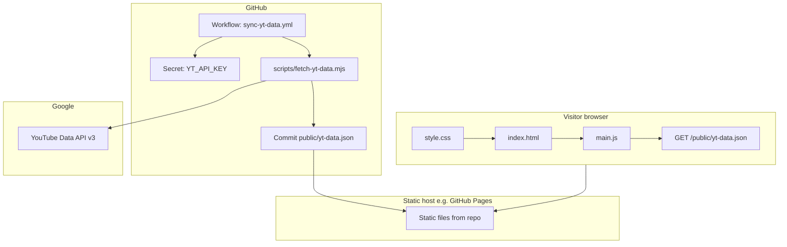

# Product Requirements Document (PRD)

## kaim.live — KaiM Brand Homepage

| Field | Value |
|--------|--------|
| **Product** | Single-page marketing and careers site for the KaiM creator brand |
| **Primary URL** | `https://kaim.live/` (canonical in `index.html`) |
| **Stack** | Static HTML, CSS, vanilla JavaScript; no application server |
| **Repository layout** | `index.html`, `style.css`, `main.js`, `assets/`, `public/yt-data.json`, `scripts/`, `.github/workflows/` |
| **Document version** | 1.1 |
| **Last reviewed** | 2026-04-22 |

---

## 1. Executive summary

**kaim.live** is a full-viewport hero landing page that introduces the **KaiM** brand, surfaces two YouTube channels (**KaiM** `@SubToKaiM` and **KaiAim** `@AimKaiM`), lists **open and closed job roles**, and routes interested applicants to a **Formspree**-backed application form plus **Discord** and **Twitter** contact options.

The experience is intentionally **cinematic and motion-rich** on capable devices while **degrading gracefully** for reduced motion preferences, coarse pointers, and narrow viewports. Channel statistics and the KaiM “top six videos” rail can be **hydrated from committed JSON** produced by a **GitHub Actions** job that calls the **YouTube Data API v3** on a bi-weekly schedule—without introducing a backend.

---

## 2. Product goals

| ID | Goal | Success criteria |
|----|------|------------------|
| G1 | Establish brand presence | Clear hero, typography, and visual hierarchy within seconds of load |
| G2 | Drive traffic to YouTube | Every channel card and contextual video tile links to the correct channel or video |
| G3 | Recruit talent | Open roles are discoverable; descriptions expandable; apply path is obvious and validated |
| G4 | Stay accurate over time | View counts and top-video rail reflect YouTube after automated sync; offline/failure keeps last shipped HTML/JSON |
| G5 | Ship as static hosting | No server-side runtime; all dynamic data is either client-side fetch of static files or CI-written JSON |

### 2.1 Non-goals (explicit)

- No authenticated user accounts or member area.
- No CMS or in-browser content editing.
- No real-time YouTube polling from the browser (refresh cadence is CI-driven, roughly bi-weekly).
- No API proxy or server-side key hiding beyond “key only in GitHub Actions secrets.”

---

## 3. Primary users and scenarios

### 3.1 Fan or newcomer

1. Lands on hero, reads tagline.
2. Scrolls to **Channels**, compares KaiM vs KaiAim, clicks through to YouTube.
3. Optionally watches top KaiM videos from the marquee rail.

### 3.2 Job seeker

1. Scrolls to **Open Positions**.
2. Expands a role to read the description.
3. Clicks **Apply now** on a role → page scrolls to **Interested?**, highlights contact panel, opens apply drawer, pre-selects role in the form.
4. Completes form and submits (double-confirm flow).

### 3.3 Maintainer / operator

1. Ensures `YT_API_KEY` exists in GitHub Actions secrets.
2. Runs **Sync YouTube Data** workflow manually or waits for cron.
3. Verifies `public/yt-data.json` commit and spot-checks site after deploy.

---

## 4. System architecture

### 4.1 High-level diagram

### 4.2 Runtime data flow (page load)

1. Browser requests `index.html`, `style.css?v=…`, `main.js?v=…`, images, fonts.
2. `main.js` runs after DOM ready (`defer`).
3. **`hydrateChannels()`** (async): `fetch('/public/yt-data.json', { signal: AbortController })` with a **10s** timer that calls `controller.abort()`.
4. On **success**: `renderChannels(data)` mutates DOM (channel totals; KaiM marquee if `topVideos.length >= 6`; KaiAim rail via **`renderKaiaimRail(data.kaiaimTopVideos)`** when that array has at least one valid **`videoId`** — one tile uses **`video-card--solo`** (no horizontal strip); two or more use a scrollable row, not a marquee).
5. On **failure** (network, non-2xx, abort, invalid JSON): `console.warn(...)`; **DOM is left unchanged**, then **`+`** is appended to **`[data-kaim-total-views]`**, **`[data-kaiaim-total-views]`**, and every **`[data-video-views]`** that does not already end with **`+`** (signals “at least this many” since the last successful sync). On **success**, `renderChannels` applies counts **without** trailing **`+`** (and strips a trailing **`+`** from JSON defensively).
6. **`initVideoMarquee`** runs on **each** `[data-video-marquee]` root inside `hydrateChannels`’s **`finally`** so the marquee always initializes **after** any hydration, independent of fetch outcome.

### 4.3 Build / sync data flow (CI)

1. Workflow triggers on **schedule** or **workflow_dispatch**.
2. Node 20 executes `scripts/fetch-yt-data.mjs` with `YT_API_KEY`.
3. Script reads existing `public/yt-data.json` to compute **rank deltas** vs previous top lists (KaiM top six, KaiAim top up to six).
4. Script writes updated JSON and workflow commits with message containing **`[skip ci]`** to avoid recursive workflow noise (GitHub honors skip phrases on push).

---

## 5. Information architecture (single page)

| Anchor / region | `id` or landmark | Purpose |
|------------------|------------------|---------|
| Hero | `#hero` | Brand impact, scroll cue |
| Channels | `#channels` | Two channel rows: card + video rail |
| Open positions | `#positions` | Careers accordion + closed roles |
| Contact | `#contactSection` | CTA, external links, apply drawer |
| Footer | `.footer-bar` | Copyright |

**Scroll restoration:** `history.scrollRestoration = 'manual'`; on load and `pageshow` (bfcache), `scrollTo(0,0)` so revisits start at top.

---

## 6. Page sections — functional requirements

### 6.1 Document head (`index.html`)

| Requirement | Detail |
|-------------|--------|
| Charset & viewport | UTF-8; viewport includes `viewport-fit=cover` for notched devices |
| Title | `KaiM` |
| Description | Short meta for SERP/snippet |
| Open Graph / Twitter | Title, description, `summary_large_image`, **`og:image` / `twitter:image`** → `https://kaim.live/assets/img/KaiM.png` with **`og:image:width` / `height` / `alt`** (and **`twitter:image:alt`**), url `https://kaim.live/` |
| Canonical | `https://kaim.live/` |
| Icons | **`rel="icon"`** → `assets/img/favicon.svg` (minimal mark, distinct from OG art so embeds do not duplicate the tab icon). **`apple-touch-icon`** → `assets/img/KaiM.png` |
| Fonts | Google Fonts: **Inter** (400,600,700,800) + **JetBrains Mono** (400); loaded with `media="print" onload="this.media='all'"` pattern + `noscript` fallback |
| LCP hint | `preload` on `assets/img/Banner.jpg` with `fetchpriority="high"` |
| Stylesheet | `style.css` with cache-busting query `?v=73` (bump when CSS changes materially) |
| Script | `main.js?v=53` (bump when JS changes materially) |

### 6.2 Hero

**Structure**

- `header.hero` contains full-viewport background image (`#heroImg`), gradient `hero-overlay`, centered `hero-content` (title + tagline), and `scrollIndicator` (chevron SVG).

**Visual behavior (CSS)**

- `.hero-img` starts with `filter: blur(0) brightness(0.9)`.
- After intro class `.hero-intro-ready` is applied, image transitions to **`blur(6px) brightness(0.42)`** (slightly less blur on narrow screens in media query).
- `.hero-title` and `.hero-tagline` animate from **opacity 0** + slight **translate/scale** to final state with staggered cubic-bezier transitions.
- `.scroll-indicator` fades in after intro delay; SVG uses **`bob`** keyframe (vertical oscillation).

**JavaScript behavior**

- `startIntro()` runs immediately:
  - Forces reflow on hero (`void hero.offsetHeight`).
  - Double `requestAnimationFrame` then adds **`hero-intro-ready`** to `#hero`.
  - Sets `introComplete = true` after **2200ms** (gates scroll-indicator fade tied to scroll position—indicator only reacts after intro completes).

**Scroll-linked behavior**

- On scroll (`tick`), if `introComplete`, `scrollIndicator` opacity decays: `max(0, 1 - scrollY / 250)`.

**Parallax (hero only, always when in range)**

- `updateHeroParallax()` while `scrollY <= 1.35 * viewportHeight`:
  - Scales and translates `#heroImg` based on `scrollY`.
  - Uses **lighter motion** when `liteMotion` (viewport &lt; 768 or coarse pointer) is true.

### 6.3 Channels

Each **channel row** is a flex layout: **channel card column** + **video shell column**.

#### 6.3.1 KaiM row

**Channel card (`a.channel-card.gold`, `data-tilt`)**

- Links to `https://youtube.com/@SubToKaiM` (new tab, `noopener`).
- Layers: `.card-glass` (backdrop blur), background profile image `.card-pfp` at low opacity, `.card-shimmer` sweep on hover, content z-stacked above.
- Displays name **KaiM**, handle `@SubToKaiM`, YouTube glyph, **total views** inside `.card-views` → inner **`span[data-kaim-total-views]`** (default text `38M`).

**Video marquee (`[data-video-marquee]`)**

- Six **`a.video-card`** elements with `data-video-rank="1"` … `"6"`, each with:
  - `span.video-card__views[data-video-views]` (badge),
  - `img[data-video-thumb]` (thumbnail `src` uses the same **`https://i.ytimg.com/vi/{videoId}/maxresdefault.jpg`** pattern as committed **`public/yt-data.json`** — no duplicate JPEGs under **`assets/`**; if the top six **videoId** values change in JSON, update **`index.html`** fallbacks for accurate no‑JS / first paint),
  - `span.video-card__title[data-video-title]` (title in overlay),
  - Default `href` to channel; after hydration with valid data, `href` becomes `https://www.youtube.com/watch?v={videoId}`.

**Marquee mechanics (`initVideoMarquee`)**

1. Idempotent: if `data-video-marquee-ready="1"`, return.
2. Locates `.video-marquee__track` and first `.video-marquee__set`.
3. **Deep-clones** the set, marks clone `aria-hidden="true"`, sets **`tabindex="-1"`** on all cloned links (keyboard users skip duplicate links).
4. Appends clone so track contains **two identical sets** for seamless loop.
5. Sets all images in track to `loading="eager"` (avoids lazy decode jank in moving strip).
6. **Startup delay:** one `requestAnimationFrame` then **`setTimeout`**: **200ms** on desktop, **400ms** when **`liteMotion`** is true, then **`scheduleMarqueeFrame()`**. Defers the initial **`loopW`** read until layout and eager thumbnails are stable (reduces “black gap after one lap” on narrow viewports).
7. **Animation:** `requestAnimationFrame` loop advances `accumPx` by `pxPerSec * deltaTime`; `pxPerSec` is **44** normally, **26** if `prefers-reduced-motion: reduce`.
8. **Bounded offset:** when **`loopW > 0`** and **`accumPx >= loopW`** (or **`accumPx`** is extremely large for float safety), wrap with **`((accumPx % loopW) + loopW) % loopW`** — not every frame, to avoid subtle jitter from repeated **`%`** on small deltas.
9. Transform: `translate3d(-accumPx px, 0, 0)` on the track.
10. **`loopW`** from **`readLoopWidth()`**: **`Math.floor`** of the **minimum** of usable candidates — gap between the two sets’ **`getBoundingClientRect().left`**, **`set.scrollWidth`**, and **`track.scrollWidth / 2`** (plus **`set.offsetWidth`** fallback) — so **`loopW`** is never **larger** than the true repeat distance (an overestimate caused black past the first clone). Recomputed whenever **`loopW`** is **0**.
11. **Pause on hover** for fine pointers (`(hover: hover)` media): `mouseenter` / `mouseleave` toggle `paused`.
12. **ResizeObserver** (debounced ~180ms) on the **track only** (not the inner set — observing the set fired during card stagger and caused rail flicker), plus **`window` `load` (once)**, call **`invalidateWidth`**: always **`loopW = 0`** to force remeasure on the next frame. If **`liteMotion`** is true (viewport **&lt; 768** or **`pointer: coarse`**), also **`accumPx = 0`**. If **`liteMotion`** is false, **`accumPx`** is **not** reset (avoids a visible hitch during staggered card entrance).
13. **`visibilitychange`**: resumes scheduling frames when tab visible.

**Video card entrance (CSS + IO)**

- `.channel-videos-shell` for delays 2/3 uses special rules: shell stays `opacity: 1` but children `.video-card` start **opacity 0** and offset `translateY(var(--vc-rise))`.
- When shell gains `.is-visible` (see scroll reveal), cards stagger via `--vc-i` and `transition-delay: calc(var(--vc-i) * var(--vc-dur))`.
- **Important:** `nth-child` rules in CSS target order inside `.video-marquee__set`; duplicated cards in the clone are `aria-hidden` and do not participate in focus order.

#### 6.3.2 KaiAim row

**Channel card (`a.channel-card.blue`, `data-tilt`)**

- Accent variable resolves to **pink** (`--accent-pink`) for views label tinting.
- Total views in **`span[data-kaiaim-total-views]`** (default `256K`).
- Links to `https://youtube.com/@AimKaiM`.

**Video rail (`[data-kaiaim-video-rail]`)**

- Wrapper **`div.video-static.video-static--kaiaim`**; seed HTML is a single **`a.video-card.video-card--solo`** (fallback until JSON loads).
- After a successful fetch, **`renderKaiaimRail`** rebuilds children from **`kaiaimTopVideos`** (0–6 entries, capped by upload count): **one** video ⇒ solo class (no carousel / strip); **two or more** ⇒ plain **`video-card`** tiles, **`video-static--multi`** for horizontal overflow (no **`initVideoMarquee`**). Same **`data-video-*`** hooks as the KaiM cards for badges and stale **`+`** behavior.

#### 6.3.3 YouTube data hydration (client)

**Constants & URL**

- `YT_DATA_URL = '/public/yt-data.json'`.

**`renderChannels(data)`**

1. Guard: `if (!data?.channels) return` (optional chaining).
2. Sets **`[data-kaim-total-views]`** and **`[data-kaiaim-total-views]`** via **`querySelectorAll`** + `forEach` when formatted totals exist.
3. **KaiM marquee:** if `topVideos` is an array with **`length >= 6`**, for each entry **`continue`** if missing `videoId` or card; scope to **`[data-video-marquee]`**; update thumb, badge, title, `href` via **`data-video-rank`**.
4. **KaiAim rail:** **`renderKaiaimRail(data.kaiaimTopVideos)`** — no-op if missing/empty/invalid rows; otherwise replaces rail contents (see **§6.3.2**).

**`hydrateChannels()`**

- Async function; top-level call is **`hydrateChannels()`** (no separate `initVideoMarquee` invocation elsewhere).
- **`finally`**: `clearTimeout` + **`document.querySelectorAll('[data-video-marquee]').forEach(initVideoMarquee)`**.

**Committed seed file (`public/yt-data.json`)**

- Seed may include `topVideos: []` and **`kaiaimTopVideos: []`** until a successful sync fills KaiM’s six slots and KaiAim’s ranked list (length grows with uploads, up to six).

### 6.4 Open positions

**Header**

- Title “Open Positions”; subtitle “consistent remote work”.

**Layout**

- `.positions-grid` is CSS grid; **open roles** appear before **closed** roles via `:has(.role-card:not(.closed))` order rules.

**Open role cards (`[data-role]` on `.role-card.glass`, not `.closed`)**

Each card:

- **Header** `.role-header` with `role="button"`, `tabindex="0"`, `aria-expanded` toggled by script.
- Columns: icon SVG, `.role-text` (title + meta), `.role-right` (green dot, `.role-badge`, chevron).
- **Drawer** `.role-drawer` with description and **Apply now** `button[data-apply][data-apply-role="…"]`.

**Roles (copy source of truth: HTML)**

| Role | Meta | Badge | Apply role string |
|------|------|-------|---------------------|
| Concept Artist | Both channels | Part-time | `Concept Artist` |
| Community Manager | Discord + socials | Volunteer | `Community Manager` |
| Channel Production Manager | Both channels | Full-time | `Channel Production Manager` |

**Closed roles container (`[data-closed-roles]`)**

- Toggle button `#closedRolesToggle` (`[data-closed-toggle]`) with label “Closed positions”, meta “3 roles”, chevron.
- `aria-controls="closedRolesPanel"`; panel `#closedRolesPanel` is `role="region"` `aria-labelledby` toggle.
- When open: `.closed-roles.is-open`, chevron rotates 180°, panel `max-height` animated (~2200px cap).

**Closed role cards**

- `.role-card.closed`: lower opacity; hover lift **disabled** via CSS.
- Red **closed** dot; badge text includes “Full-time · Closed”.
- Thumbnail Artist, Visual Effects Artist, Video Cutter — drawers contain description only (no apply CTA in HTML).

**Accordion behavior (JS)**

- Clicking a role header calls `toggle()`:
  1. Closes **every** `[data-role].expanded` (class + `aria-expanded` + `maxHeight=0`).
  2. If clicked card was not open, opens it: `expanded` class, `aria-expanded=true`, `drawer.style.maxHeight = scrollHeight + 'px'`.
- **Keyboard:** Enter / Space on header triggers same toggle (`preventDefault` on Space).

### 6.5 Contact — Interested?

**Layout & visuals**

- `#contactPanel.contact-cta` with green-tinted radial gradients (distinct from gold positions section).
- Heading `#contactInterested` “Interested?”.

**Actions**

- **Apply** button `#applyToggle` (`data-apply-toggle`) toggles `#applyDrawer` (max-height transition, `aria-expanded` / `aria-hidden`).
- **Discord** link: `https://discord.com/users/1421906052537913385`
- **Twitter / X** link: `https://twitter.com/SubToKaiM`

**Apply drawer & form**

- Form `#applyForm`: `POST` to `https://formspree.io/f/maqanvwa`, `novalidate` (custom validation in JS).
- Hidden `_subject`: `KaiM website application`.
- Honeypot `_gotcha` field (`.apply-honeypot`) visually off-screen for bot mitigation.
- Fields: name, email, role `<select>`, portfolio URL, message textarea (`maxlength="20000"`).
- Live word count `#applyWordCount` with `aria-live="polite"`.
- Status line `#applyFormStatus` with `role="status"`.

**Role select options**

- Concept Artist, Community Manager, Channel Production Manager, Other / general (values match strings above).

**Apply from role cards**

- `openApplyFromRoles(roleName)`:
  1. `resetApplySubmitArm()` (clears double-submit state).
  2. `scrollInterestedHeadingToTop()` smooth scroll to `#contactInterested` (fallback: first `h2` in panel).
  3. `pulseContact()` adds/removes `pulse-gold` animation class on `#contactPanel`.
  4. Opens apply drawer, selects matching `<option>` by value.
  5. `setTimeout(focusApplyFormFirst, 400)` to focus first real field.

**Apply toggle click**

- If opening: scroll to heading, open drawer, focus first field, clear status classes/text, reset submit arm.

**Escape key**

- If apply drawer open → close, reset arm, focus apply toggle.
- Else if closed roles open **and** focus is inside closed panel or on toggle → close closed roles, focus toggle.

**Form validation (`validateApplyForm`)**

| Rule | Behavior |
|------|----------|
| Name | Non-empty trim |
| Email | Trim; regex `^[^\s@]+@[^\s@]+\.[^\s@]+$` |
| Role | Non-empty value |
| Portfolio | Non-empty; `isValidPortfolioUrl` — normalized with `https://` if missing; requires plausible hostname + TLD |
| Message | **25–250 words** (split on whitespace) |

**Word count UI**

- Updates on `input` and `change`.
- Submit button **disabled** when word count out of range.
- CSS classes for under/over limits on count + textarea.

**Double-submit confirmation (“arm”)**

1. First successful validation: does **not** POST immediately.
2. Sets `applySubmitArmed=true`, stores snapshot of all field values joined by record separator `\x1e`.
3. Changes submit button label to **“Click again to send”**, adds `.apply-submit-confirm` (pulsing gold ring animation).
4. Shows pending status: click again to confirm.
5. Second click: verifies snapshot unchanged and validation still passes → POST via `fetch` + `FormData`, `Accept: application/json`.
6. If Formspree returns `{ ok: true }`: success message, reset form, reset arm.
7. If anything fails: user-facing error string; submit re-enabled in `finally`.

**Legacy guard**

- If form `action` contains `REPLACE_ME`, shows error that form is not connected (historical dev guard; production action is real Formspree id).

**Mutation during armed state**

- Any `input`/`change` that alters snapshot resets arm and clears status styling.

### 6.6 Footer

- Centered “© 2026 KaiM” with muted typography and gradient hairline `::before`.

---

## 7. Cross-cutting interactions

### 7.1 Scroll reveal (`IntersectionObserver`)

- Targets every `.scroll-reveal`.
- **`is-visible`** uses **hysteresis** on **`intersectionRatio`** (many **`threshold`** steps) so the class does not flip at the viewport edge while scrolling: latch on when **`ratio >= 0.1`**, latch off when **`ratio < 0.03`**, with **`data-reveal-latched`** mirroring that state. **`rootMargin`** bottom inset **`-5%`** (slightly less aggressive than **`-6%`**).
- **Exit:** class removed when latched off—elements mirror transition back (opacity/transform).

**Stagger attributes**

- `data-reveal-delay="1" | "2" | "3"` maps to transition-delay on **enter only** (CSS comment: stagger on enter; exit immediate).

### 7.2 Section parallax (`[data-parallax]`)

- Each element stores `speed` from attribute (float).
- **Visibility tracked** by second `IntersectionObserver` with large `rootMargin` (`120px` vertical) and `threshold: 0`.
- On scroll **`tick`**, `updateLayerParallax()` runs only if **not** `liteMotion` and **not** `prefersReducedMotion`:
  - For each visible layer, compute vertical offset from viewport center and apply `translate3d(0, (center/vh)*speed*52 px, 0)`.
- Off-screen layers get transform cleared when `visible === false`.

### 7.3 Channel card 3D tilt (`[data-tilt]`)

- Only if `(pointer: fine)` and width ≥ **640px**.
- `mousemove`: `requestAnimationFrame` throttled single rAF: sets `rotateY` / `rotateX` from pointer position within card rect, plus slight scale.
- `mouseleave`: smooth transition back to identity transform.

### 7.4 Reduced motion (`prefers-reduced-motion: reduce`)

CSS disables or simplifies: smooth scroll auto, scroll-indicator bob, card shimmer animation, drawer transition, apply confirm pulse, marquee CSS keyframe class, scroll-reveal **spatial** offset (fade retained per file comment).

JS: marquee speed reduced; parallax for layers skipped; hero parallax still runs but with smaller coefficients.

### 7.5 Focus visibility

- Global `:focus-visible` outline gold (`--accent-gold`) with offset; links and buttons included.

---

## 8. Design system (CSS tokens)

| Token | Role |
|-------|------|
| `--bg-base` | Near-black page background |
| `--bg-surface` | Translucent glass surfaces |
| `--border-subtle` / `--border-hover` | Hairline borders |
| `--text-primary` / `--text-muted` | Body hierarchy |
| `--accent-gold` | KaiM accents, focus rings, pulses |
| `--accent-blue` | Primary action buttons in roles |
| `--accent-pink` | KaiAim card accent chain |
| `--shadow-card` | Card elevation |
| `--font-display` / `--font-body` | Inter |
| `--font-mono` | JetBrains Mono (handles, small labels, some UI chrome) |

**Scrollbar:** hidden (`scrollbar-width: none` + webkit display none) for aesthetic full-bleed layout.

---

## 9. YouTube sync pipeline (detailed)

### 9.1 Workflow file (`.github/workflows/sync-yt-data.yml`)

| Step | Behavior |
|------|----------|
| Trigger | Cron `0 10 1,15 * *`; manual `workflow_dispatch` |
| Permissions | `contents: write` (commit + push) |
| Checkout | `actions/checkout@v4` |
| Node | `actions/setup-node@v4`, version **20** |
| Run | `node scripts/fetch-yt-data.mjs` with env `YT_API_KEY` |
| Commit / push | Stage `public/yt-data.json`; commit only if staged diff is non-empty (shell **or** between `git diff --staged --quiet` and `git commit -m "chore: sync YouTube data [skip ci]"`); then always **`git push`** |

**Operational prerequisites**

- Repository secret **`YT_API_KEY`** with YouTube Data API v3 enabled in Google Cloud project.
- Branch is typically **`main`**; default `git push` pushes current checked-out branch.

### 9.2 Fetch script (`scripts/fetch-yt-data.mjs`)

**Configuration** (see **§9.3** to add channels or rails.)

- `CHANNELS.kaim`: handle `SubToKaiM`, **`topVideoLimit: 6`** (`TOP_VIDEO_COUNT`).
- `CHANNELS.kaiaim`: handle `AimKaiM`, **`topVideoLimit: 6`** (same cap; output length is **`min(6, uploads with stats)`**).
- Output: `OUTPUT_PATH = new URL('../public/yt-data.json', import.meta.url)` → `fileURLToPath` for I/O; **`YT_BASE`** for API URLs; **`node:fs/promises`** for read/write; missing key → **`process.stderr.write`** + **`process.exit(1)`**. JSON includes **`topVideos`** (KaiM, up to six) and **`kaiaimTopVideos`** (KaiAim, zero to six).

**API usage pattern (quota-friendly)**

1. `channels.list` with `forHandle`, `part=statistics,snippet,contentDetails` — **1 unit** per channel (two calls).
2. For **each** channel with `topVideoLimit > 0`: read that channel’s **`uploads`** playlist id.
3. Paginate `playlistItems.list` per channel — **1 unit per page** (KaiM + KaiAim each walk their own uploads list).
4. **Single merged** `videos.list` pass: dedupe **union** of both channels’ upload video ids, batch up to **50** ids per request — **1 unit per batch** total (not per channel).

No `search.list` (expensive).

**Ranking**

- For each channel, build scored rows from the shared **`videos.list`** map for **every** upload id on that channel’s list (with statistics).
- Sort descending by views; **`slice(0, min(topVideoLimit, count))`** so the global top‑N is correct when a **new** upload outranks a former top‑six entry.

**Rank metadata**

- Reads previous file; builds **`Map<videoId, previousRank>`** for KaiM from **`topVideos`** and for KaiAim from **`kaiaimTopVideos`**; if the map is empty, migrates legacy **`kaiaimFeaturedVideo.videoId`** as rank **1** for one cycle.
- For each new row: `previousRank` from map or **`null`**; **`isNewEntry`** = **`previousRank === null`**; **`rankDelta`** = **`null`** if new, else **`previousRank - rank`** (positive ⇒ moved up); **`isTopThree`**: `rank <= 3`.

**Formatting**

- **`formatChannelNumber`**: channel totals / subscribers; **no** trailing `+` on millions (matches card design).
- **`viewCountFormatted`** (top videos): **`formatChannelNumber`** — same as channel totals (no **`+`** suffix).
- Hidden subscriber count ⇒ `subscribers: null`, `subscribersFormatted: "hidden"`.

**Thumbnail selection**

- **`snippet.thumbnails.maxres.url`** when present; otherwise the constructed fallback **`https://i.ytimg.com/vi/{id}/maxresdefault.jpg`** only (no `high` / `medium` tiers).

**Failure modes**

- Missing `YT_API_KEY`: exit code **1**, stderr: `Error: YT_API_KEY environment variable is not set.`
- API HTTP error: thrown with status + first **200** chars of body.
- Existing file read/JSON parse failure when building previous ranks: **empty map** (first run).

### 9.3 Adding or extending channels (playbook)

The fetcher is driven by a single config object and one loop, but **where video rows land in JSON** and **how the page hydrates** are still **key-specific** (`kaim` → `topVideos`, `kaiaim` → `kaiaimTopVideos`). Adding a channel is **easy for totals-only**; adding **another rail** needs a small, explicit extension in three places (script branch, JSON shape, `renderChannels` + HTML).

#### 9.3.1 `CHANNELS` entry (required fields)

| Field | Purpose |
|-------|---------|
| **`key`** | Stable id (`kaim`, `kaiaim`, …). Must match **`channels.{key}`** in JSON and your **`data-{key}-total-views`** attribute stem in HTML. |
| **`handle`** | YouTube handle **without** `@` (passed to `channels.list` **`forHandle`**). |
| **`topVideoLimit`** | **`0`** = channel **statistics only** (no uploads playlist walk, no extra quota). **Positive integer** = fetch uploads, sort by views, keep top **N**. |

**Insertion point:** add a new property to the **`CHANNELS`** object in `scripts/fetch-yt-data.mjs` (order only affects API call sequence, not output keys).

#### 9.3.2 What you get for free

- Every configured channel receives **`out.channels[def.key]`** from **`buildChannelBlock`** (totals, subscribers, formatted strings).
- **GitHub Actions** does not need edits for a new channel — the same workflow runs the script and commits **`public/yt-data.json`**.

#### 9.3.3 Stats-only channel (`topVideoLimit: 0`)

1. Add e.g. `other: { key: 'other', handle: 'SomeHandle', topVideoLimit: 0 }`.
2. In **`index.html`**, add a channel card row (or reuse pattern) with **`…`** inside `.card-views` (fallback number).
3. In **`main.js` → `renderChannels`**, mirror KaiM/KaiAim: read **`data.channels.other?.totalViewsFormatted`** and assign to **`querySelectorAll('[data-other-total-views]')`**.
4. In **`markStaleViewLabelsWithPlus`**, add **`[data-other-total-views]`** to the selector list so failed fetches mark that total too.

No script changes beyond **`CHANNELS`** for step 1 if you only need totals (the loop **`continue`s** when `topVideoLimit` is falsy).

#### 9.3.4 Another “KaiM-style” rail (top **N** videos, ranked list in JSON)

Today **`kaim`** writes **`topVideos`** and **`kaiaim`** writes **`kaiaimTopVideos`**. To add a third rail:

1. **Script:** In `main()`, after building **`top`** for the new key, assign to a **new** root property (e.g. **`otherTopVideos`**) or refactor to a generic map. Extend **`readPreviousState()`** to build a **`Map`** from **`prev.otherTopVideos`** the same way as **`topVideos`** for rank deltas.
2. **`public/yt-data.json`:** Seed **`otherTopVideos: []`** until CI runs; document the schema next to **`topVideos`**.
3. **HTML:** Marquee (or static stack) with **`data-video-rank="1"`…`"N"`**, **`data-video-thumb`**, **`data-video-views`**, **`data-video-title`**; scope under a root **`[data-other-marquee]`** (or reuse **`data-video-marquee`** only if one rail exists per page area).
4. **`main.js`:** Duplicate the KaiM block: require **`data.otherTopVideos.length >= N`**, query the new root, loop by **`video.rank`**. Call **`initVideoMarquee`** on that root in **`hydrateChannels`’s `finally`** (same pattern as KaiM: init **after** hydrate so clones match DOM).

#### 9.3.5 Another “KaiAim-style” top‑N rail (array in JSON)

Today **`kaiaim`** writes **`kaiaimTopVideos`** (array, same row shape as **`topVideos`**). For a second channel with the same UX pattern:

1. **Script:** Add a root array (e.g. **`otherTopVideos`**) and an **`else if (def.key === 'other')`** branch after ranking; extend **`readPreviousState()`** with a **`Map`** from **`prev.otherTopVideos`**.
2. **HTML:** A **`[data-other-video-rail]`** wrapper with fallback **`video-card`**(s), mirroring **`data-kaiaim-video-rail`**.
3. **`main.js`:** Call a small renderer (copy **`renderKaiaimRail`** pattern) from **`renderChannels`**.

#### 9.3.6 Naming and consistency checklist

| Layer | Convention |
|-------|--------------|
| Config **`key`** | Lowercase slug; matches **`channels.{key}`** and **`data-{key}-total-views`**. |
| JSON | Channel stats always under **`channels`**. Video lists are **root-level** today (`topVideos`, `kaiaimTopVideos`); new lists should stay **documented** in this PRD and in a short comment at top of **`fetch-yt-data.mjs`**. |
| Stale **`+` on error** | Any new total-view span must be added to **`markStaleViewLabelsWithPlus`**’s selector. |

#### 9.3.7 Longer-term refactor (optional)

To make **N rails** trivial without `if (def.key === 'kaim')` branches, refactor toward e.g. **`channelTopVideos: { kaim: [...], kaiaim: [...] }`**, with each UI region declaring **`data-channel-key`** and **`data-layout="marquee|rail"`**. That is **not** implemented today; the playbook above matches the current repo.

---

## 10. Assets and external dependencies

| Asset / dependency | Path / URL | Notes |
|--------------------|------------|-------|
| Banner | `assets/img/Banner.jpg` | Hero LCP image |
| Brand PNG | `assets/img/KaiM.png` | OG/Twitter large preview; Apple touch |
| Favicon (tab) | `assets/img/favicon.svg` | Small **`rel="icon"`** only — not used as **`og:image`** |
| Channel avatars | `assets/img/KaiM-card.jpg`, `KaiAim-card.jpg` | Card backgrounds |
| Video rail thumbnails | YouTube `i.ytimg.com/.../maxresdefault.jpg` (same pattern as **`thumbnail`** in **`public/yt-data.json`**) | **`index.html`** static `src` mirrors the committed JSON for no‑JS / first paint; **`renderChannels`** / **`renderKaiaimRail`** overwrite from JSON when fetch succeeds. No bundled JPEG copies in **`assets/`**. |
| Fonts | `fonts.googleapis.com` | Inter + JetBrains Mono |
| Form backend | `formspree.io/f/maqanvwa` | POST JSON response expected |

---

## 11. Accessibility requirements

| Area | Implementation |
|------|----------------|
| Role accordions | `role="button"`, `aria-expanded`, keyboard activation |
| Closed roles | `aria-controls` / `aria-labelledby` / `aria-hidden` on panel |
| Apply drawer | `aria-expanded` on toggle, `aria-hidden` on drawer |
| Marquee duplicate | `aria-hidden="true"`, `tabindex="-1"` on cloned links |
| Form status | `role="status"`, `aria-live` on word count |
| Motion | Respects `prefers-reduced-motion` in CSS and partially in JS |
| Focus | Visible focus ring on keyboard focus |

**Known gaps / follow-ups (optional backlog)**

- Some decorative images use `alt=""`; hydrated video thumbs set `alt` to title (good). Card PFPS remain decorative.
- Ensure color contrast for muted text on glass surfaces meets WCAG targets (visual audit).

---

## 12. Performance notes

- Hero image preload + `fetchpriority="high"`.
- Fonts non-blocking via print media swap trick.
- Marquee uses `transform` + `requestAnimationFrame` (compositor-friendly).
- Parallax skipped when off-screen (IntersectionObserver gating).
- `will-change: transform` on moving layers where justified (cards, track).
- `content-visibility` was **avoided** on `#channels` per CSS comment (broke marquee width measurement).

---

## 13. Security & privacy

| Topic | Approach |
|-------|----------|
| YouTube API key | **Never** in client; only GitHub Actions secret server-side in CI |
| Form spam | Formspree endpoint + honeypot field `_gotcha` |
| External links | `rel="noopener"` on `target="_blank"` anchors |
| Application data | Submitted to Formspree over HTTPS; site does not store submissions |

---

## 14. Analytics, SEO, and sharing

- **SEO:** title, meta description, canonical, OG tags, Twitter card.
- **No in-repo analytics** documented; addendum if Google Analytics or Plausible is injected at host level.

---

## 15. Release & versioning checklist

1. Bump `style.css?v=` when CSS changes should bypass CDN/browser caches.
2. Bump `main.js?v=` when JS behavior changes.
3. After changing `public/yt-data.json` schema, update **both** script and `renderChannels` in lockstep.
4. Verify `https://kaim.live/public/yt-data.json` (or staging) returns **200** with correct CORS (same-origin fetch—N/A for simple static).
5. Run GitHub workflow manually post-deploy to validate secrets and API quota.

---

## 16. Open issues / future enhancements (not implemented)

- Surface `subscribersFormatted` on channel cards (data already in JSON).
- Use `topVideos` rank metadata in UI (badges for “new” or movement)—JSON ready, UI not wired.
- Internationalization (i18n).
- Subpath deployment base URL for `fetch` if site is not at domain root.
- Automated Lighthouse or Playwright smoke tests in CI.

---

## 17. Glossary

| Term | Meaning |
|------|---------|
| **Hydration** | Client JS replacing text/media from `yt-data.json` after load |
| **Marquee** | Horizontally scrolling duplicated rail of video cards |
| **Glass** | Frosted translucent panel style (`.glass`) |
| **Arm state** | First click validates + arms; second click sends apply form |

---

## 18. Document ownership

This PRD describes the **kaim.live** codebase as implemented in the repository that contains this file. When behavior and document diverge, **code is authoritative** until this document is updated.
